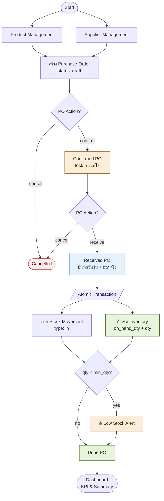
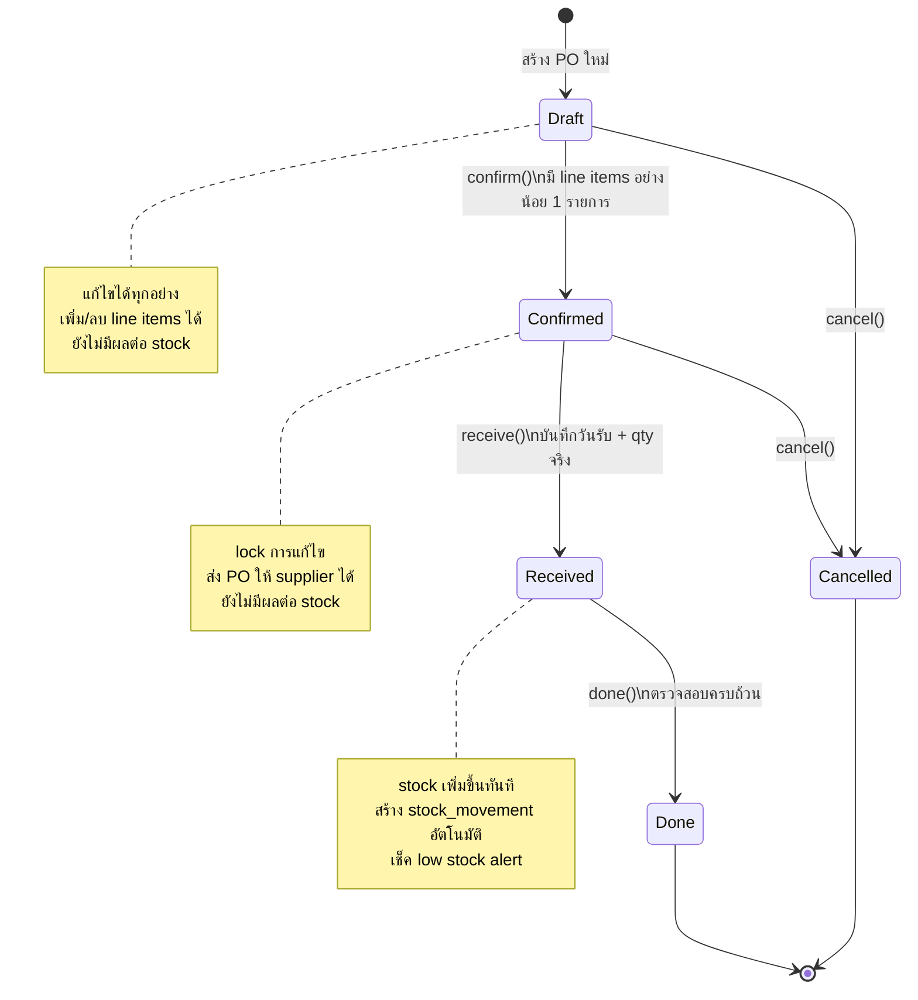
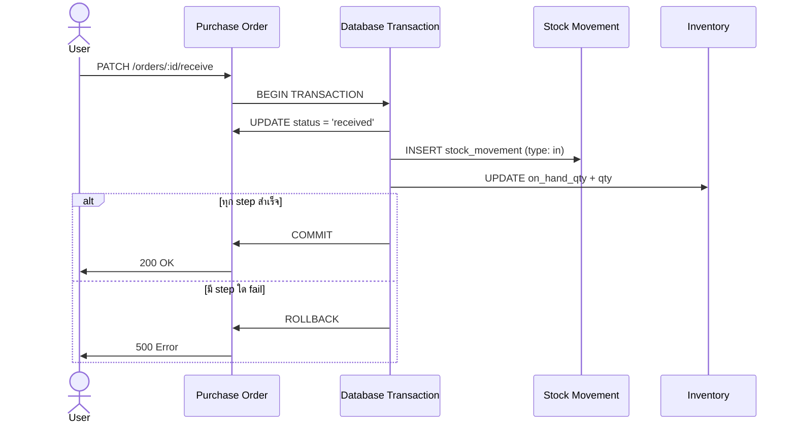
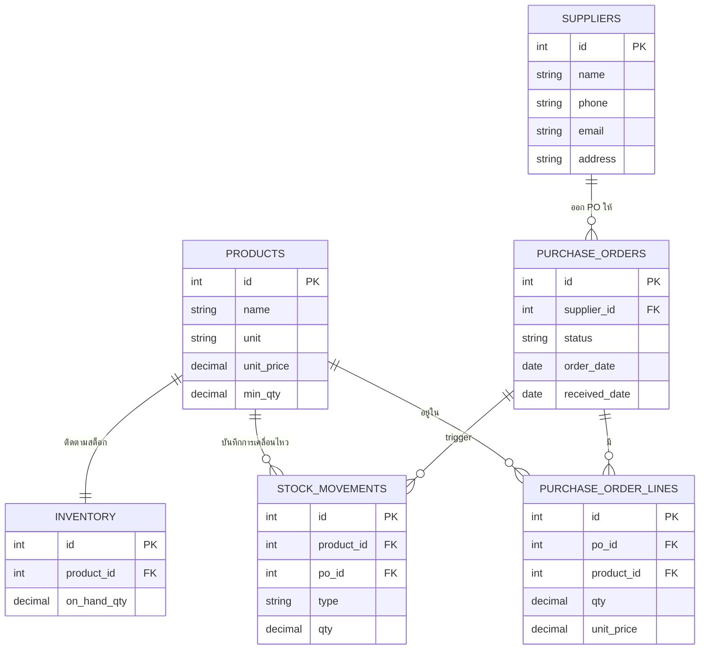
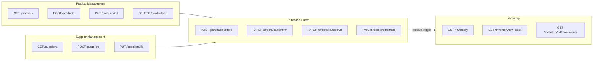

# Workflow Documentation

ระบบ Purchase & Inventory Management จำลอง business workflow ของ Odoo ERP
ประกอบด้วย 5 module หลักที่ทำงานเชื่อมกันผ่าน Core Database

---

## 1. Business Flow Overview

ภาพรวมการทำงานของทุก module ตั้งแต่ต้นจนจบ

---

## 2. Purchase Order — State Machine

แสดงสถานะทั้งหมดของ PO และเงื่อนไขการเปลี่ยนสถานะ

---

## 3. Atomic Transaction — เมื่อรับสินค้า

เมื่อกด receive ระบบต้องทำ 3 อย่างนี้พร้อมกันใน transaction เดียว
ถ้า step ใด fail จะ rollback ทั้งหมด

---

## 4. Module Relationships

ความสัมพันธ์ระหว่าง module และ database tables

---

## 5. API Flow Summary

สรุป endpoint หลักของแต่ละ module

